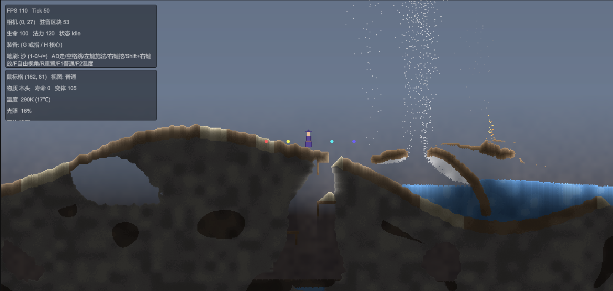

# Cinder

> 一个在 Unity 6 中构建的 **Noita 风格真像素物质模拟沙盒**。世界中的每一个像素都是一种可交互材料，水、沙、火、烟、爆炸与挖掘都直接改写同一张细密物理网格——而非用噪声把粗格子伪装成“看起来很细”。

---

## 游戏展示



---

## 项目简介

Cinder 的根本目标不是调色板或后处理特效，而是把世界的基础空间单位做“细”：

- 每个可交互物理像素都是独立的材料单元；
- 一个世界单位 = 4 个细物理格（`WorldScale.CellsPerUnit = 4`），角色约占 `12×20` 格，普通可跨越台阶仅为 `1–2` 格；
- 结构、背景、材质、光照、粒子彼此独立，前景地形不再独自承担全部美术信息；
- 正常视图由 GPU 从紧凑材料缓冲绘制：`PackCellsJob`（Burst）把细格直接写入 `GraphicsBuffer`，单 DrawCall 上传，主循环零托管分配。

这与 Noita 的公开原则一致：世界中的每个像素都是材料并参与模拟。

## 核心特性

- **真像素物质模拟**：沙、岩、水、油、火、烟、岩浆、木、金属、雪等材料在同一种细网格中流动、燃烧、置换、熄灭。
- **多物理场通道**：移动求解（落沙元胞自动机）+ 可热插拔的 `ISimChannel` 通道——光照、温度、反应各自独立运行。
- **无限宽 · 有限深世界**：区块（128×128 格）动态流式加载与卸载，确定性种子世界生成（高度图 + 洞穴 + 矿脉 + 水囊 + 岩浆层），底部不可破坏基岩。
- **可破坏地形**：挖掘、放置、投射物命中真实改写世界；火焰拖尾会自然引燃木头产生连锁反应。
- **数据驱动热插拔玩法**：武器 / 效果 / 角色 / 物品均以数据 + 接口组合，运行时增删即生效，新增模块不改框架代码。
- **Noita 式法杖施法**：四类法术（投射物 / 修饰符 / 多重施法 / 触发）按容量、法力、施法延迟、充能折叠成施法链，支持扇形多重施法。
- **效果装配图**：拾取到的效果拖进一张节点图，连线到核心即让当前法杖拥有该效果。
- **像素碰撞角色**：`PixelBody` 逐轴 AABB 解算，`Character` FSM 驱动 Idle / Moving / Jumping / Falling / Dead，程序化生成 12×20 细格巫师精灵。
- **GPU Cell Surface 渲染**：单 Quad + 自定义 `CellSurface.shader`，三缓冲 `GraphicsBuffer`，`F2` 切温度热力图，全程无中间数组、无 `SetData` 拷贝。
- **确定性 & 可单测**：随机性全部来自坐标 / tick / 种子哈希，模拟与渲染逻辑可在 EditMode 下零场景测试。

## 架构

代码按职责切分为零耦合依赖的若干程序集（asmdef），依赖方向单向向下：

```text
Cinder.Core         零依赖共享基座（无项目引用）
  ├─ Modules/       IModule + ModuleRegistry<T>           注册表模式
  ├─ Attributes/    AttributeSet / Attribute / Modifier  修饰栈（Add→Mul→Override）
  └─ StateMachine/  StateMachine<TContext> / IState       有限状态机

Cinder.Simulation   纯数据模拟引擎（引用 Burst / Collections / Mathematics，allowUnsafeCode）
  ├─ Cell / ChunkData / WorldGrid / WorldGenerator（确定性生成）
  ├─ SimulationWindow（区块滑动窗口，双缓冲） + SimulationEngine
  ├─ MaterialProps（MaterialTable / ReactionRule）+ BuiltinMaterials
  ├─ Channels/      ISimChannel / LightChannel / ThermalChannel / ReactionChannel
  └─ Jobs/          FallingSandJob / GenerateChunkJob / LightJob / ThermalJob / ReactionJob / PackCellsJob

Cinder.Game         玩法层（引用 Core + Simulation）
  ├─ Effects/       ProjectileEffectDefinition 装饰器链 + 内置效果(Ignite/Freeze/Explosive/Trail/StatModifier) + EffectBus/EffectHandlers/SimEffectWorld
  ├─ Spells/        SpellDefinition 体系(Projectile/Modifier/Multicast/Trigger) + WandInstance 施法管线
  ├─ Weapons/       WeaponDefinition/Instance/Factory + WeaponEffectGraph（效果装配图）+ EffectStash（效果背包）
  ├─ Characters/    CharacterDefinition / Character（FSM）+ Physics/PixelBody（像素碰撞）
  └─ Items/         ItemDefinition / Inventory / Equipment（属性装备）

Cinder.Runtime     MonoBehaviour 胶水层（引用 Core + Game + Simulation + InputSystem）
  ├─ World/         WorldController / WorldStreamer / CellSurfaceRenderer(GPU) / FlyCamera / WorldBootstrap / ChunkStore / EffectPickup
  ├─ Player/        PlayerController / WindowCellSampler
  ├─ Combat/        Projectile（投射物 + 命中行为链）
  ├─ Materials/     MaterialDatabase / MaterialDefinition（热插拔物质表）
  ├─ UI/            WeaponCanvasController（C 键六边形节点图，OnGUI 绘制）
  └─ GameContent    数据加载入口（玩家 / 法杖 / 物品 / 演示内容）

Cinder.Tests.EditMode  Editor-only 单元测试（NUnit，引用全部运行时 + TestRunner）
```

模拟与渲染严格解耦：**Simulation** 是唯一材料真源（细网格），**Runtime** 只读取并负责绘制与交互。内部设计文档见 `docs/`（注：`docs/` 已通过 `.gitignore` 排除，不随仓库发布）。

### 三种空间必须分离

| 空间 | 用途 | 规则 |
| --- | --- | --- |
| 细物理格坐标 | 模拟 / 碰撞 / 挖掘 / 材料流动 | 整数坐标，唯一的材料真源 |
| 世界坐标 | 相机 / 角色 Transform / 粒子 / 结构 | `world = cell / CellsPerUnit`（= 4） |
| 屏幕像素 | GPU 最终输出 | 只负责显示，不参与物理 |

### GPU Cell Surface 渲染管线

`CellSurfaceRenderer` 用一个覆盖整个模拟窗口的 Quad + `CellSurface.shader` 完成全部绘制：

1. 每帧（LateUpdate 末尾、效果总线 Flush 之后）由 `PackCellsJob`（Burst）直接写入 `GraphicsBuffer`（`LockBufferForWrite`，无中间托管数组、无 `SetData` 拷贝）；
2. 三缓冲轮转（`RingSize = 3`）避免改写 GPU 正在读的帧；仅在内容变化或视图模式切换时才打包上传；
3. 调色板与材质参数在物质表重建时作为静态 `GraphicsBuffer` 一次性上传；
4. 缓冲区只在窗口尺寸变化时重建，主循环零分配。

## 技术栈

| 类别 | 选型 |
| --- | --- |
| 引擎 | Unity 6000.3.10f1 |
| 渲染管线 | URP 2D + 自定义 `CellSurface.shader`（GraphicsBuffer / Compute 风格直写） |
| 性能 | Burst + Unity.Collections（NativeArray 双缓冲、LockBufferForWrite） |
| 数学 | Unity.Mathematics |
| 输入 | Input System（新 API：`Keyboard.current` / `Mouse.current`） |
| 测试 | NUnit EditMode（`-runTests -testPlatform EditMode`） |
| 语言 | C# |

## 目录结构

```text
Assets/_Project/
  Scripts/
    Core/         Cinder.Core.asmdef         共享基座（模块 / 属性 / 状态机）
    Simulation/   Cinder.Simulation.asmdef   纯模拟引擎（含 Channels / Jobs）
    Game/         Cinder.Game.asmdef         玩法（效果 / 法术 / 武器 / 角色 / 物品）
    Runtime/      Cinder.Runtime.asmdef      渲染 / 流式 / 输入 / 引导 / UI
    Editor/       编辑器工具与资产生成器
  Tests/EditMode/ Cinder.Tests.EditMode.asmdef  单元测试
  Resources/Cinder/  程序化材质与数据库资产（零外部图片）
  Shaders/CellSurface.shader  细格表面着色器
  Scenes/World.unity          正式游戏场景（含玩家与图谱 UI）
docs/              内部设计文档（已被 .gitignore 排除，不入库）
images/            仓库截图（README 引用，正常提交）
```

## 快速开始

### 运行游戏

1. 使用 **Unity 6000.3.10f1**（或兼容的 6000.3.x）打开本工程目录。
2. 打开场景 `Assets/_Project/Scenes/World.unity`。
3. 点击 **Play**：`WorldBootstrap` 会在任意场景自动创建世界与相机；正式场景由 `WorldController` 引导。

### 操作方式

| 操作 | 按键 |
| --- | --- |
| 移动 | `A` / `D` 或 `←` / `→` |
| 跳跃 | `Space` 或 `W` |
| 朝鼠标施法 | 鼠标左键 |
| 自由视角（飞行相机） | `F` 切换（开启时禁用角色输入） |
| 打开 / 关闭效果装配图 | `C`（游戏中暂停移动与开火） |
| 切换演示装备 | `G` / `H` |
| 重置世界 | `R`（清存档并重新生成地形） |
| 调试视图 | `F1` 正常画面，`F2` 温度热力图 |


